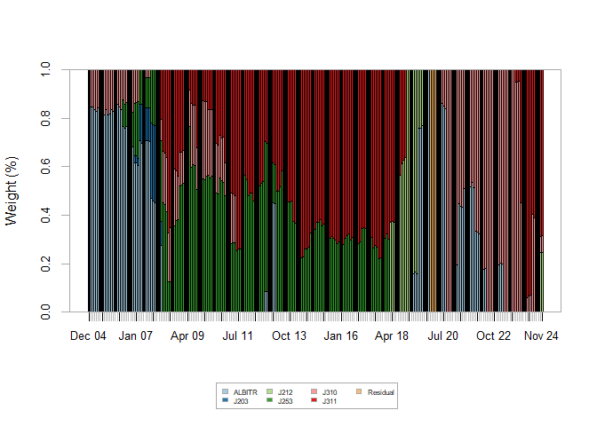
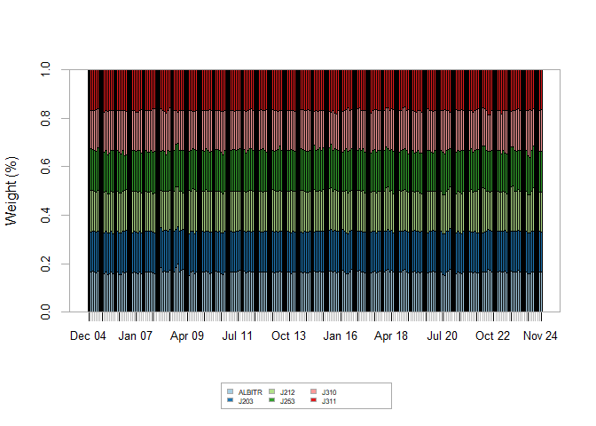

# Coding for the Financial Econometrics Essay on Risk Parity Portfolios

In this markdown folder I will explain my thinking and working for the
coding aspect of the Financial Econometrics essay submitted in January
2025. I will talk through the coding done to get the results represented
in the written report of this essay

    ##          used (Mb) gc trigger (Mb) max used (Mb)
    ## Ncells 468628 25.1    1008744 53.9   660385 35.3
    ## Vcells 865842  6.7    8388608 64.0  1770183 13.6

## Packages

What follows is the list of packages that have been used throughout the
functions of this project:

-   tidyverse (includes ggplot2, dplyr)
-   Texevier
-   fmxdat
-   PerformanceAnalytics
-   tbl2xts
-   kableExtra
-   RColorBrewer
-   riskParityPortfolio
-   quadprog

## Setting up the Data

The Data_Setup function takes the data folders provider by the
administrator of the module and reads them into data frames. The Stock
specific daily data for the JSE is adapted to only include the current
top 40 stocks listed on the exchange. The index specific data is
filtered for all indices that are relevant to constructing the
portfolio, as referenced in the written report. The mean of the
short-term fixed-interest assets across the sample is used as the risk
free rate, this is used later in the Maximum Sharpe ratio portfolio.

This function then returns a list variable that includes the data of the
stocks, indices and relevant rebalance dates that can be referenced at
later points.

## Assets Portfolios Construction

Here the data from the initial function is parsed to the
Sector_Risk_Parity function to construct and plot relevant aspects of
the portfolios. The first thing that is done in this function is to
impute the missing values of the indices that have starting points after
other indices. This is a seperate function called impute_missing_returns
that, when used with the specifics that I have, will draw the
replacement values from the distribution of that specific variable.
