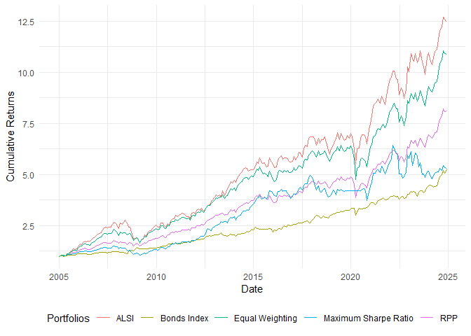

# Coding for the Financial Econometrics Essay on Risk Parity Portfolios

In this markdown folder I will explain my thinking and working for the
coding aspect of the Financial Econometrics essay submitted in January
2025. I will talk through the coding done to get the results represented
in the written report of this essay

## Packages

What follows is the list of packages that have been used throughout the
functions of this project:

-   tidyverse (includes ggplot2, dplyr)
-   Texevier
-   fmxdat
-   PerformanceAnalytics
-   tbl2xts
-   kableExtra
-   RColorBrewer
-   riskParityPortfolio
-   quadprog

## Setting up the Data

The Data_Setup function takes the data folders provider by the
administrator of the module and reads them into data frames. The Stock
specific daily data for the JSE is adapted to only include the current
top 40 stocks listed on the exchange. The index specific data is
filtered for all indices that are relevant to constructing the
portfolio, as referenced in the written report. The mean of the
short-term fixed-interest assets across the sample is used as the risk
free rate, this is used later in the Maximum Sharpe ratio portfolio.

This function then returns a list variable that includes the data of the
stocks, indices and relevant rebalance dates that can be referenced at
later points.

## Assets Portfolios Construction

Here the data from the initial function is parsed to the
Sector_Risk_Parity function to construct and plot relevant aspects of
the portfolios. All relevant plots that are computed along the way and
the dataset with the returns of the relevant portfolio are returned in a
list variables. The first thing that is done in this function is to
impute the missing values of the indices that have starting points after
other indices. This is a separate function called impute_missing_returns
that, when used with the specifics that I chose, will draw the
replacement values from the distribution of that specific variable.

The first step was to look at the different methods of risk parity that
is allowed by the riskParityPortfolio. This is compared to an equal
weighting portfolio to demonstrate differences in approach. The RPP + mu
is chosen as it allows for the additional consideration of returns in
the construction of the portfolio.

Next I can look at the risk versus return balance of the Risk Parity
portfolio when computed with the additional optimisation on returns, as
can be seen there is decreasing marginal returns in Expected Return when
taking on additional risk. This is done by running through a for loop of
different lambda_mu values, a weighting parameter that sets the focus
between risk and returns optimisation. These values are then stored and
plotted.

Next, other function are created in order to calculate the relevant
weights of the different portfolios at each rebalance date. The
risk_parity function takes in a dataset and the current date as
arguments and then returns the relevant weights looking back at the 5
years prior to the current date to optimise the portfolio using the
riskParityPortfolio package and the RPP + mu method. A similar function
is then built for the Maximum Sharpe ratio portfolio, this function is
called max_sharpe_ratio and takes the same argument

